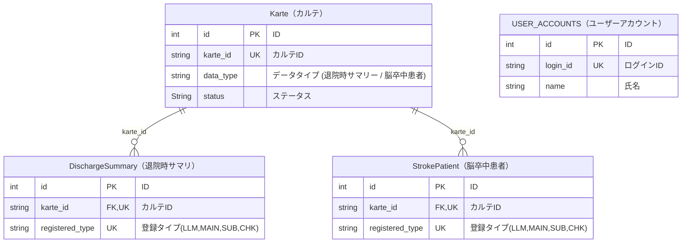

# abeja_medical_LLM_annotation

# 環境構築
- (Dockerのインストール)
- cd abeja_medical_LLM_annotation
- docker compose up --build

# バックエンド
## サンプルアプリ(認証なし)
### doc
- http://localhost:80/docs
### 動作確認
```bash
curl http://localhost:80/
```
```bash
curl -X POST http://localhost:80/user_accounts -H  'Content-Type: application/json' -d '{"login_id": "test_id_1","password": "test_password_1","name": "test_name_1"}'
```
```bash
curl -X GET http://localhost:80/user_accounts
```

## サンプルアプリ(※ログイン認証あり)
### doc
- http://localhost:70/docs
### 動作確認(認証方法)
### JWTトークンを利用したログイン認証
```bash
curl http://localhost:70/

→"ok"%
```
```bash
curl -X POST http://localhost:70/user_accounts -H  'Content-Type: application/json' -d '{"login_id": "test_id_3","password": "test_password_3","name": "test_name_3"}'

→{"id":XX,"login_id":"XXXXXX","name":"XXXXXX"}% 

```
```bash
curl -X GET http://localhost:70/user_accounts_with_auth/me

(認証失敗)
→{"detail":"Not authenticated"}%
```
```bash
(ログイン)
curl -X POST http://localhost:70/login \
     -H 'Content-Type: application/x-www-form-urlencoded' \
     -d 'username=test_id_3&password=test_password_3'

(ログイン成功トークン取得)
→{"access_token":"ey･･････.･･････,"token_type":"bearer"}%
```
```bash
(上記で取得したaccess_tokenを利用する)
curl -X GET http://localhost:70/user_accounts_with_auth/me -H 'Authorization: Bearer ey･･････.･･････'

(認証成功)
→{"id":XX,"login_id":"XXXXXX","name":"XXXXXX"}%
```

## テストデータベース


### DB構造変更時の初期化

```SQL
drop table discharge_summaries;
drop table stroke_patients;
drop table user_accounts;
drop table kartes;
```

# フロントエンド

開発環境（ローカル）
前提

Docker Desktop が起動していること

Node.js 20+ / npm がインストール済み

Windows の場合は PowerShell か cmd

Backend（FastAPI + MySQL）
# リポジトリ直下
docker compose up -d

**Note:** MySQLのヘルスチェックが設定されているため、バックエンドはMySQLの準備が完了してから自動的に起動します。
手動でDBを先に起動する必要はありません。

# 状態確認
docker compose ps

docker compose logs -f

docker compose down

FastAPI の自動ドキュメントは **http://localhost:80/docs**（Swagger UI）です。

Frontend（Next.js）
cd frontend
# 初回のみ
npm i
# 環境変数
  PowerShell: cp .env.example .env.local
  cmd:        copy .env.example .env.local
  Devサーバ
npm run dev → http://localhost:3000 をURL入力


# 環境変数
frontend/.env.local
 
 例：
NEXT_PUBLIC_API_BASE_URL=http://localhost:80

NEXT_PUBLIC_ で始まる変数はクライアント（ブラウザ）にバンドルされます（公開前提の値のみ）。 


# 動作確認（Quick Verify）

http://localhost:80/docs
 が開く（バックエンド起動確認） 
fastapi.tiangolo.com

http://localhost:3000
 が表示される
ブラウザのコンソールで文字列が表示されるので、それをクリック
→ OKなのが出るのを確認する。

トラブルシュート

3306番ポートが使用中で DB が起動できない → 既存 MySQL を停止するか、docker-compose.yml の ports を 3307:3306 に変更

フロントから 405（Method Not Allowed） → ブラウザURL直打ちは GET になるため、/sample_post には POST で送る

フロントから BE へ届かない → NEXT_PUBLIC_API_BASE_URL 値、rewrites 設定、npm run dev の再起動を確認
