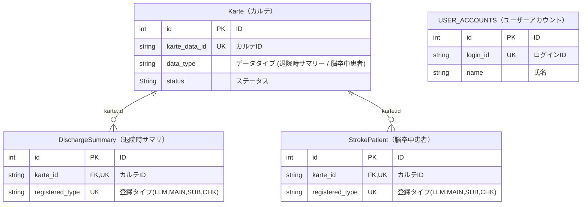

# abeja_medical_LLM_annotation

# 環境構築

## Docker環境（推奨）

### 本番モード（最適化ビルド）
```bash
cd abeja_medical_LLM_annotation
docker compose up -d --build
```

### 開発モード（ホットリロード対応）
```bash
cd abeja_medical_LLM_annotation
docker compose -f docker-compose.yml -f docker-compose.dev.yml up -d --build
```

**開発モードの特徴**:
- ✅ コード変更が即座に反映（リビルド不要）
- ✅ `frontend/src/`を編集すると自動リロード
- ✅ Docker内で完結（ローカルPCを汚さない）

### モード切り替え
```bash
# 開発モード → 本番モード
docker compose down
docker compose up -d --build

# 本番モード → 開発モード
docker compose down
docker compose -f docker-compose.yml -f docker-compose.dev.yml up -d --build
```

# バックエンド
## v1_fastapi_sample
### サンプルアプリ(認証なし)
### doc:http://localhost:80/docs
### 動作確認
```bash
curl http://localhost:80/
# →"ok"%

curl -X POST http://localhost:80/user_accounts -H  'Content-Type: application/json' -d '{"login_id": "test_id_1","password": "test_password_1","name": "test_name_1"}'

curl -X GET http://localhost:80/user_accounts
```

## v1.1_fastapi_sample_with_auth
### サンプルアプリ(※ログイン認証あり)
### doc:http://localhost:70/docs
### 動作確認(JWTトークンを利用したログイン認証)
```bash
curl http://localhost:70/
# →"ok"%

curl -X POST http://localhost:70/user_accounts -H  'Content-Type: application/json' -d '{"login_id": "test_id_3","password": "test_password_3","name": "test_name_3"}'
# →{"id":XX,"login_id":"XXXXXX","name":"XXXXXX"}% 

curl -X GET http://localhost:70/user_accounts_with_auth/me
# (認証失敗)
# →{"detail":"Not authenticated"}%

# (ログイン)
curl -X POST http://localhost:70/login \
     -H 'Content-Type: application/x-www-form-urlencoded' \
     -d 'username=test_id_3&password=test_password_3'
# (ログイン成功トークン取得)
# →{"access_token":"ey･･････.･･････,"token_type":"bearer"}%

# (上記で取得したaccess_tokenを利用する)
curl -X GET http://localhost:70/user_accounts_with_auth/me -H 'Authorization: Bearer ey･･････.･･････'
# (認証成功)
# →{"id":XX,"login_id":"XXXXXX","name":"XXXXXX"}%
```
## v2_input_annotation
### アノテーション入力用APIの追加
### doc:http://localhost:82/docs
### 動作確認
```bash
# ユーザーアカウント 1件登録
curl -X 'POST' 'http://localhost:82/user_accounts/' -H 'accept: application/json' -H 'Content-Type: application/json' \
   -d '{  "login_id": "test_id_4"
         ,"password": "test_password_4"
         ,"name": "test_name_4"}'
# →レスポンスのIDを記録し、院時サマリ登録時の"registered_by"の値として設定する。

# カルテ 1件登録
curl -X 'POST' 'http://localhost:82/kartes/' -H 'accept: application/json' -H 'Content-Type: application/json' \
  -d '{ "karte_data_id": "123",
        "karte_name": "test_name",
       "data_type": "DC"
      }'
# →レスポンスのIDを記録し、院時サマリ登録時の"karte_id"の値として設定する。

# 退院時サマリ 1件
curl -X 'POST' 'http://localhost:82/discharge_summaries/' -H 'accept: application/json' -H 'Content-Type: application/json' \
  -d '{  "karte_id": 1,
         "registered_type": "SUB",
         "registered_at": "2025-11-11T14:07:34.252Z",
         "registered_by": 1,
         "patient_name": "string",
         "patient_id": "string"
      }'

# カルテ 一覧
curl -X 'GET' 'http://localhost:82/kartes/?skip=0&limit=100' \
  -H 'accept: application/json'

# 退院時サマリ 一覧
curl -X 'GET' 'http://localhost:82/discharge_summaries/?skip=0&limit=100' -H 'accept: application/json'
```

## テストデータベース


### DB構造変更時の初期化

```sql
-- DB構造変更した場合(以下実行後 再度 ビルド)
drop table discharge_summaries;
drop table stroke_patients;
drop table kartes;
drop table user_accounts;

-- データのみ削除する場合
delete from discharge_summaries;
delete from stroke_patients;
delete from kartes;
delete from user_accounts;
ALTER TABLE discharge_summaries AUTO_INCREMENT = 1;
ALTER TABLE stroke_patients AUTO_INCREMENT = 1;
ALTER TABLE kartes AUTO_INCREMENT = 1;
ALTER TABLE user_accounts AUTO_INCREMENT = 1;

-- その他
select * from kartes;
select * from discharge_summaries;
select * from stroke_patients;
select * from user_accounts;


```

# フロントエンド

開発環境（ローカル）
前提

Docker Desktop が起動していること

Node.js 20+ / npm がインストール済み

Windows の場合は PowerShell か cmd

Backend（FastAPI + MySQL）
# リポジトリ直下
docker compose up -d

**Note:** MySQLのヘルスチェックが設定されているため、バックエンドはMySQLの準備が完了してから自動的に起動します。
手動でDBを先に起動する必要はありません。

# 状態確認
docker compose ps

docker compose logs -f

docker compose down

FastAPI の自動ドキュメントは **http://localhost:80/docs**（Swagger UI）です。

Frontend（Next.js）
cd frontend
# 初回のみ
npm i
# 環境変数
  PowerShell: cp .env.example .env.local
  cmd:        copy .env.example .env.local
  Devサーバ
npm run dev → http://localhost:3000 をURL入力


# 環境変数
frontend/.env.local
 
 例：
NEXT_PUBLIC_API_BASE_URL=http://localhost:80

NEXT_PUBLIC_ で始まる変数はクライアント（ブラウザ）にバンドルされます（公開前提の値のみ）。 


# 動作確認（Quick Verify）

http://localhost:80/docs
 が開く（バックエンド起動確認） 
fastapi.tiangolo.com

http://localhost:3000
 が表示される
ブラウザのコンソールで文字列が表示されるので、それをクリック
→ OKなのが出るのを確認する。

トラブルシュート

3306番ポートが使用中で DB が起動できない → 既存 MySQL を停止するか、docker-compose.yml の ports を 3307:3306 に変更

フロントから 405（Method Not Allowed） → ブラウザURL直打ちは GET になるため、/sample_post には POST で送る

フロントから BE へ届かない → NEXT_PUBLIC_API_BASE_URL 値、rewrites 設定、npm run dev の再起動を確認
